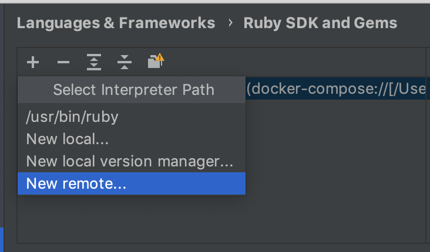

# how to use docker in development

### IMPORTANT (1 Warning)
- DON'T INSTALL ANY RUBY、DATABASE、WEB SERVICE IN YOUR MAC
- DON'T INSTALL ANY RUBY、DATABASE、WEB SERVICE IN YOUR MAC
- DON'T INSTALL ANY RUBY、DATABASE、WEB SERVICE IN YOUR MAC

### How To Start
- All of MacOS already install Docker and load some docker images
- Use some command to check your docker service is work or not. `docker -v` `docker images`
- Make sure have `docker-compose.yml` and folder `docker` in your project. (I will set up those always)

### How to use(in the project folder)
- `docker-compose up` : start development environment
- `docker-compose down` : stop development environment
- `docker-compose run <<command>>` : run command in docker container. for example `docker-compose run app rails c` or `docker-compose run app rails g model xxxxxx`
- `docker ps` : list all running containers.
- `docker attach <<NAMES>>` : Names can find from `docker ps`. It's can use in read rails server log.

### How to new Rails project via Docker
1. copy `docker-compose.yml` and folder `docker` into your new project folder. [link](./basic-composer)
1. new Gemfile and add `source 'https://rubygems.org'` `gem 'rails', '~>5'`
1. new Gemfile.lock.(empty)
1. `docker-compose build`
1. `docker-compose up`
1. try localhost:3000 in browser

### Rubymine
1. `command+,`: search keyword `ruby` and click `Ruby SDK and Gems`

1. `+`

1. `ok`

1. rubymine can read all you install Gems from docker container

### QA
- `docker-compose up` fail , it's looks can't read some gem I installed. *`docker-compose down -v` stop this container (disconnect volumes) and `docker-compose up` rebuild again*
- I can't stop all container via `docker-compose down`. *`docker ps` and use `docker kill <<CONTAINER ID>>`*
- I want to install a new gem. *add in Gemfile and `docker-compose run app bundle`*
- how can I restart rails server? *`docker-compose down` & `docker-compose up`*