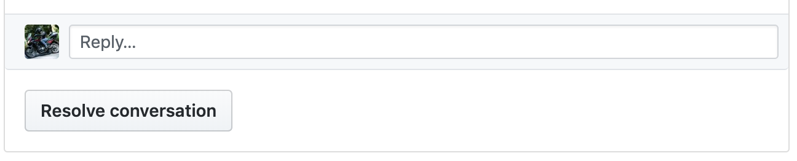

# Git rules in SWZ-IT team

### Set Up
#### same with your name in this team
```
git config --global user.name "Your Name" 
git config --global user.email "your@email.com" 
```
### 3 point will get 1 warning.

### IMPORTANT (1 Warning)
- DON'T DO ANYTHING IN MASTER BRANCH
- DON'T DO ANYTHING IN MASTER BRANCH
- DON'T DO ANYTHING IN MASTER BRANCH

### git commands
- git pull
- git push
- git checkout [branch-name]
- git reset [sha1|HEAD|HEAD^]
- git add [file | .]
- git status
- git commit -m "commit message"
- git fetch --prune

### branch naming rule (if branch not fellow this rule, **1 point**)
- "feature/this_is_a_description_for_feature"
- "hotfix/this_is_a_description_for_hotfix"

### workflow for new feature / hotfix / rspec / development
1. git checkout master
1. git pull
1. git branch 'feature/xxxxxxxx'
1. finish your feature from issues , one ticket one branch
1. all commit message have meaning and readable , don't write any message I can't understand.
1. one(or least) of commit message in the branch , you should use Github keyword, fix #1 (# + issue number in github) (if issue number wrong or forgot this stop,**1 point**)
1. git push to remote.
1. send pull request, request reviewer(your superior),and message superior within 5 minutes in slack.(if you forgot this step, **1 warning**)
1. Request Change: after you solve all question, you need to click "Resolve conversation" button and message superior within 5 minutes in slack(if you forgot this step, **1 warning**)


### Policy
1. Don't use focus push,git push --focus. (**1 warning**) 
1. Don't commit anything have nothing to do with feature, enter or space. (**1 point**)
1. You should push your code everyday.(**1 point**)
1. Do your best when you review another code, don't let me feel you nothing to do in code view. (**1 point**)
1. Commit message must be readable. (**1 point**)