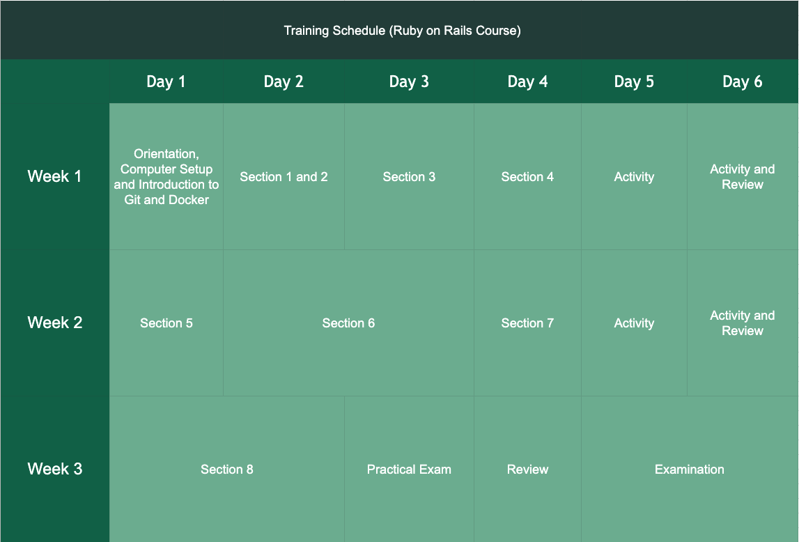

## Training Schedule

The trainees will undergo for a 3 weeks `Ruby on Rails` training course in Udemy. Please
listen to the instructor in Udemy because the trainees will have an examination in the last `2 days`
of training.

##### 1. Orientation, Computer Setup and Introduction to Git and Docker
On the First Week of schedule Day 1. The HR will orient the trainees regarding to the rules and regulations
of the company, their contract and the salaries of each trainees. After that, the seniors will discuss
about the brief introduction of Git and Docker and how to use it in the project. 
##### 2. Sections
On these days, the trainees should be focus in the class that will be provided in the Udemy. We separated it in days by the duration 
of each section in the class. The sections each day is just a measurement on how long it will take to be accomplished, so it's okay to have
a slow pace at the start as long as the trainees understand the topics in each section.
##### 3. Activities and Reviews
The trainees will be given a programming activity in every Day 5 and 6 per week. The program is related
in their current section in which to evaluate them on how much they progress in the `Ruby on Rails`. And afterwards,
reviewing the trainees about the topics they have a problem understanding. 
##### 4. Practical Exam
The trainees will be given a practical exam at the last days of the training. This exam is compose of certain topics
which they encountered throughout the class and this will serve as preparation for the upcoming real examination.
##### 5. Examination
In this day, the instructor (IT Manager) will provide the examination for the trainees. The time limit for the exam
is usually `2 days`, so be prepared and `Please READ THE INSTRUCTIONS carefully`.