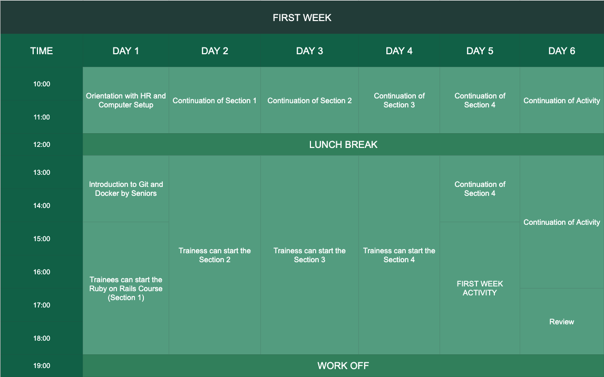

##First Week Schedule



##### First Day
- On the first day of the trainees they will have a session with the HR. They will discuss about 
information they need to know inside the company, rules and regulations about the company and
signing of contract of the trainees.
- After orientation, the trainees may now proceed to their assigned post/computer/workplace for computer setup.
- After setup, the seniors will instruct them about the git and docker, and how to use them in the project.
- After instructing, the trainees may now proceed on the `RUBY ON RAILS COURSE`.

##### Brief Information about Ruby on Rails Course
The trainees will take the `Ruby on Rails Course` in Udemy. 
````
link: https://www.udemy.com/the-complete-ruby-on-rails-developer-course/learn/lecture/3862432?start=60#overview
email: plok74122@gmail.com
password: qwer4321` 
````
- It consist of `13 sections` but in the training the limit is until `section 9`.
- Every `section` contains several `chapters` that needs to understand.
- Make sure that the trainees have `earphones`.

##### Activity
In the last `2 days` of the first week, the trainees will take an activity to observe their
progress in the training. The duration of this activity is good for `1 day` and later on the seniors
will conduct a review on the trainees.