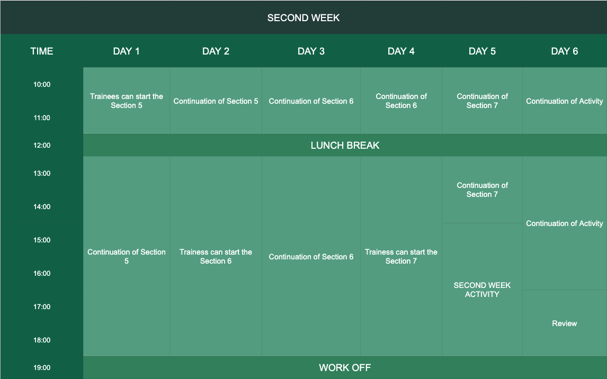

## Second Week Schedule

After the activity. The schedule for the second week is the same as the first week. The trainess
needs to focus more about these sections because it discusses about the `Associations` and `Automated Testing`.

##### Activity
The same as the first week, the trainees will take an activity in the last `2 days` of the second week to observe their
progress in the training. The duration of this activity is good for `1 day` and later on the seniors
will conduct a review on the trainees.