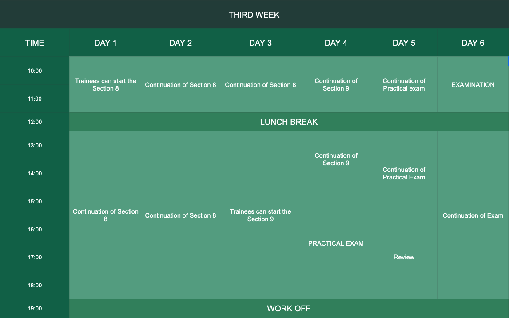

## Third Week Schedule

After the second week, the trainees should now understand about the kinds of associations.
Because in the third week these sections will tackle about a new web application.

##### Practical Exam
On the `4th day` of third week, the trainees will take a practical exam. 
- This practical exam will serve as a preparation for the upcoming examination of the trainees.
- The duration of the practical exam is `1day`. 
- Some of the functions in this exam is the same as questions in the real examination so be prepared.
- After later on, the seniors will conduct a review on the trainees.

##### Examination
In the `last day` of the training, the trainees will take the examination.

- `PLEASE READ CAREFULLY THE INSTRUCTIONS IN THE EXAM BEFORE PROCEEDING`
- The duration of this exam is only `1day`.